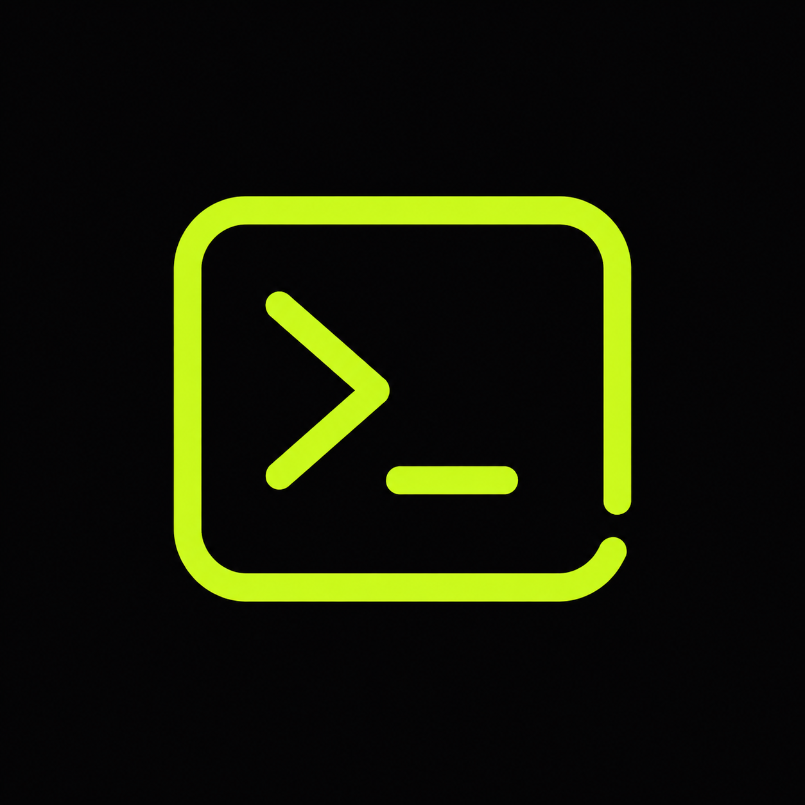
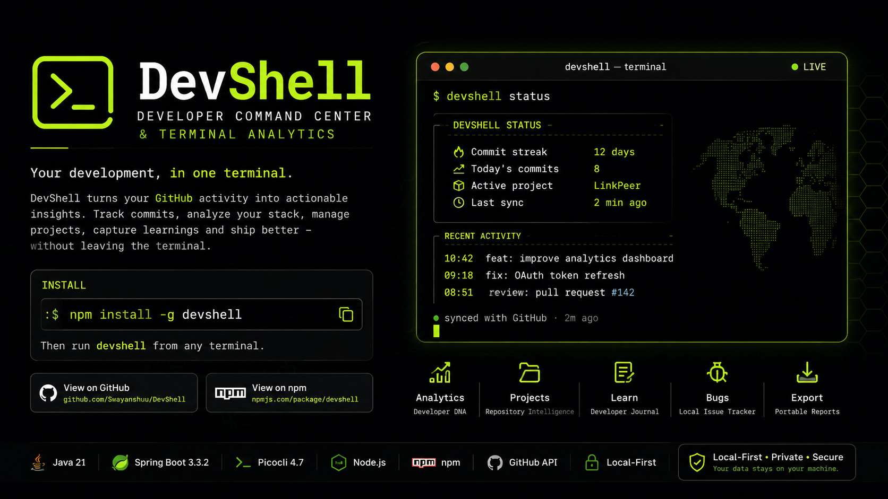
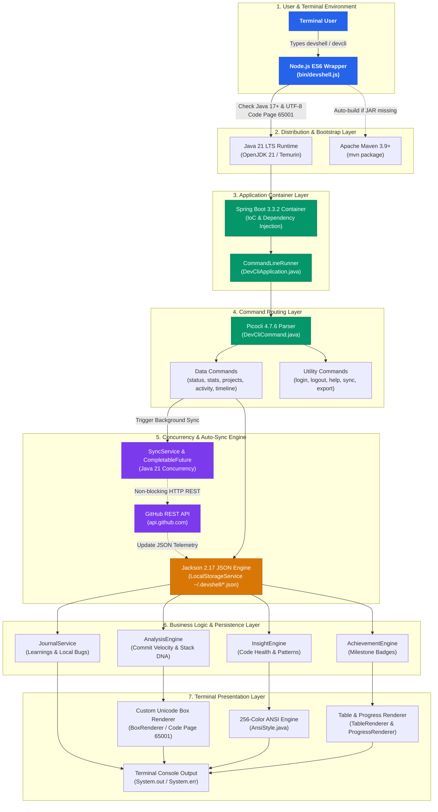

<p align="center">
  
</p>

<h1 align="center">DevShell — Developer Command Center &amp; Terminal Analytics</h1>

<p align="center">
  <strong>A high-performance, terminal-based developer analytics engine and command center built with Java 21 and Spring Boot.</strong>
</p>

<p align="center">
  <a href="https://www.npmjs.com/package/devshell"></a>
  <a href="https://www.npmjs.com/package/devshell"></a>
  <a href="https://www.oracle.com/java/"></a>
  <a href="https://spring.io/projects/spring-boot"></a>
  <a href="LICENSE"></a>
</p>

---

<p align="center">
  
</p>

---


## Quick Start

### Installation via npm

Install globally using Node Package Manager:

```bash
npm install -g devshell
```

Alternatively, run without installation using `npx`:

```bash
npx devshell
```

### Execution

Once installed, launch DevShell from any command prompt or terminal:

```bash
devshell
```

*(Note: `devcli` is also supported as a command alias).*

---

## Core Capabilities

- **Command Center Dashboard (`devshell status`)**: Displays real-time commit streak tracking, today's contribution count, active building project, and recent repository activity.
- **Developer DNA Analytics (`devshell stats`)**: Generates comprehensive language distribution percentages, PR reviews, and contribution velocity metrics.
- **Repository Management (`devshell projects`)**: Automatically categorizes your GitHub repositories into Active, Recently Active, Inactive, and Archived states. Inspect individual repository telemetry using `devshell project <name>`.
- **Developer Journal (`devshell learn`)**: Log architectural insights, stack learnings, and technical notes directly from the command line.
- **Local Issue Tracker (`devshell bugs`)**: Track and resolve local bugs prior to pushing code to remote repositories.
- **Report Export (`devshell export`)**: Export your developer profile and activity metrics to Markdown, JSON, or HTML formats.
- **Local-First Architecture**: Session credentials and cached telemetry reside locally at `~/.devshell/credentials.json` with zero external tracking.

---

## Command Reference

For comprehensive flags and options, refer to [`COMMANDS.md`](COMMANDS.md).

| Command | Function | Example |
| :--- | :--- | :--- |
| `devshell status` | Displays main dashboard snapshot (default command) | `devshell status` |
| `devshell login` | Authenticates with GitHub via OAuth browser flow or PAT | `devshell login` |
| `devshell logout` | Revokes stored credentials and clears local cache | `devshell logout` |
| `devshell stats` | Generates developer DNA report and stack breakdown | `devshell stats` |
| `devshell projects` | Lists categorized repository universe | `devshell projects` |
| `devshell project <name>` | Inspects telemetry for a specific repository | `devshell project LinkPeer` |
| `devshell activity` | Displays chronological commit and review feed | `devshell activity --today` |
| `devshell achievements` | Displays unlocked developer milestones | `devshell achievements` |
| `devshell insight` | Evaluates development patterns and code health | `devshell insight` |
| `devshell learn "<note>"` | Records a technical discovery or architectural note | `devshell learn "Spring WebClient timeout"` |
| `devshell bugs` | Manages local issue log (`--add`, `--resolve`) | `devshell bugs --add "Fix NPE"` |
| `devshell export` | Exports profile report (`--format md\|json\|html`) | `devshell export --format markdown` |
| `devshell sync` | Forces immediate synchronization with GitHub API | `devshell sync` |
| `devshell --help` | Prints CLI usage guide and options | `devshell --help` |

---

## System Architecture & Tech Stack

DevShell is engineered as a decoupled, local-first CLI application. It combines a lightweight Node.js launcher with a Spring Boot Java runtime, Picocli command routing, custom ANSI rendering, and asynchronous background synchronization.



---

### 🛠️ Tech Stack Breakdown & Technology Roles

DevShell combines a carefully selected stack of modern tools to deliver a fast, local-first CLI experience:

* **☕ Java 21 LTS (Core Language & Runtime)**
  * **Role:** Core programming language powering domain models, data transformation, pattern matching, stream analytics, and multithreading.
  * **Why:** Provides high-performance execution, strict type safety, and rich concurrency utilities for processing commit telemetry.

* **🍃 Spring Boot 3.3.2 (Application Container & DI)**
  * **Role:** Manages application bootstrapping, Dependency Injection (`@Autowired`, `@Service`, `@Component`), and bean lifecycle management via `CommandLineRunner`.
  * **Why:** Decouples core services, simplifies component wiring, and standardizes application startup and exit hooks.

* **💻 Picocli 4.7.6 (CLI Command Routing & Flag Parser)**
  * **Role:** Parses CLI subcommands (`status`, `stats`, `projects`, `bugs`, `activity`, `timeline`, `learn`, `export`), validates option flags (`--debug`, `--format`, `--add`), generates help screens, and provides custom exception handling.
  * **Why:** Industry-standard declarative CLI engine with full Spring Boot integration and ANSI color support.

* **⚡ Node.js ES6 (Cross-Platform Global Binary Wrapper)**
  * **Role:** Acts as the npm entry wrapper ([`bin/devshell.js`](file:///c:/Shibu/Everything/Dev/devcli/bin/devshell.js)). Checks for Java 17+ runtime, forces Windows Console UTF-8 (Code Page 65001), auto-packages Maven JARs if missing, and manages npm update checks.
  * **Why:** Enables instant global distribution via `npm install -g devshell` or zero-install `npx devshell` execution across Windows, macOS, and Linux.

* **🔄 Java Concurrency (`CompletableFuture`) (Background Auto-Sync Engine)**
  * **Role:** Executes non-blocking background threads in [`SyncService.java`](file:///c:/Shibu/Everything/Dev/devcli/src/main/java/com/devcli/service/SyncService.java) to pull updated GitHub repositories, commits, PRs, and issues while command output renders instantly.
  * **Why:** Eliminates network wait times for terminal commands while keeping telemetry current.

* **📄 Jackson 2.17 JSON (Local-First Persistence Engine)**
  * **Role:** Handles JSON serialization and deserialization in [`LocalStorageService.java`](file:///c:/Shibu/Everything/Dev/devcli/src/main/java/com/devcli/storage/LocalStorageService.java), writing cached profile and telemetry data directly to `~/.devshell/*.json`.
  * **Why:** Ensures strict privacy, zero external tracking, fast file IO, and offline functionality without needing heavy database drivers.

* **🎨 Custom ANSI & Unicode Box Renderer (Terminal UI Engine)**
  * **Role:** Formats 256-color ANSI highlights ([`AnsiStyle.java`](file:///c:/Shibu/Everything/Dev/devcli/src/main/java/com/devcli/ui/AnsiStyle.java)), box borders ([`BoxRenderer.java`](file:///c:/Shibu/Everything/Dev/devcli/src/main/java/com/devcli/ui/BoxRenderer.java)), data tables ([`TableRenderer.java`](file:///c:/Shibu/Everything/Dev/devcli/src/main/java/com/devcli/ui/TableRenderer.java)), progress bars ([`ProgressRenderer.java`](file:///c:/Shibu/Everything/Dev/devcli/src/main/java/com/devcli/ui/ProgressRenderer.java)), and loading spinners ([`LoadingSpinner.java`](file:///c:/Shibu/Everything/Dev/devcli/src/main/java/com/devcli/ui/LoadingSpinner.java)).
  * **Why:** Transforms raw command line text into modern, rich, dashboard-quality visual components in any terminal emulator.

* **📦 Apache Maven 3.9+ (Build System & Packaging)**
  * **Role:** Compiles 40+ Java source files, runs automated unit tests, manages dependencies in `pom.xml`, and packages the standalone executable fat JAR (`target/devshell-1.0.11.jar`).
  * **Why:** Standardized, reliable build automation for Spring Boot applications.

---

### Tech Stack & Component Responsibilities Matrix

| Layer / Subsystem | Technology | Component / Module | Responsibility & Function |
| :--- | :--- | :--- | :--- |
| **CLI Launcher & Distribution** | **Node.js (ES6)** | [`bin/devshell.js`](file:///c:/Shibu/Everything/Dev/devcli/bin/devshell.js)<br>`package.json` | Cross-platform binary launcher installed globally via `npm`. Verifies Java 17+ JRE availability, configures UTF-8 code page (65001) on Windows PowerShell/cmd, auto-packages Maven JAR if missing, and spawns Java process with explicit encoding flags. |
| **Native Shell Launchers** | **Bash / Batch** | [`devcli`](file:///c:/Shibu/Everything/Dev/devcli/devcli)<br>[`devcli.bat`](file:///c:/Shibu/Everything/Dev/devcli/devcli.bat) | Direct native fallback scripts for Unix bash and Windows Command Prompt environments. |
| **Application Container** | **Spring Boot 3.3.2** | [`DevCliApplication.java`](file:///c:/Shibu/Everything/Dev/devcli/src/main/java/com/devcli/DevCliApplication.java) | Application bootstrap, Dependency Injection container (`@Autowired`, `@Service`, `@Component`), and lifecycle management (`CommandLineRunner`, `ExitCodeGenerator`). |
| **Command Routing & Parsing** | **Picocli 4.7.6** | [`DevCliCommand.java`](file:///c:/Shibu/Everything/Dev/devcli/src/main/java/com/devcli/cli/DevCliCommand.java)<br>`com.devcli.cli.*` | Declarative command line parser mapping subcommands (`status`, `stats`, `projects`, `bugs`, `activity`, `timeline`, `learn`, etc.), option flags (`--debug`, `--format`), help formatting, and exception handling. |
| **Async Concurrency Engine** | **Java 21 Concurrency** | [`SyncService.java`](file:///c:/Shibu/Everything/Dev/devcli/src/main/java/com/devcli/service/SyncService.java) | Manages `CompletableFuture` background workers to quietly sync repositories, commits, PRs, issues, and activity events from GitHub without blocking instant terminal rendering. |
| **GitHub API Integration** | **Spring WebClient / RestTemplate** | [`GitHubService.java`](file:///c:/Shibu/Everything/Dev/devcli/src/main/java/com/devcli/service/GitHubService.java)<br>[`AuthService.java`](file:///c:/Shibu/Everything/Dev/devcli/src/main/java/com/devcli/service/AuthService.java) | Handles REST communication with `api.github.com`, manages Personal Access Token (PAT) authentication, handles rate limits, and parses raw GitHub API payloads. |
| **Local Persistence Engine** | **Jackson 2.17 JSON** | [`LocalStorageService.java`](file:///c:/Shibu/Everything/Dev/devcli/src/main/java/com/devcli/storage/LocalStorageService.java) | Local-first storage layer managing reading/writing pretty-printed JSON files in `~/.devshell/` (`profile.json`, `repositories.json`, `commits.json`, `pull_requests.json`, `issues.json`, `events.json`, `learnings.json`, `bugs.json`, `achievements.json`). |
| **Analytics & Gamification** | **Java 21 Streams & Math** | [`AnalysisEngine.java`](file:///c:/Shibu/Everything/Dev/devcli/src/main/java/com/devcli/service/AnalysisEngine.java)<br>[`InsightEngine.java`](file:///c:/Shibu/Everything/Dev/devcli/src/main/java/com/devcli/service/InsightEngine.java)<br>[`AchievementEngine.java`](file:///c:/Shibu/Everything/Dev/devcli/src/main/java/com/devcli/service/AchievementEngine.java) | Computes contribution velocity, tech stack percentage distributions, streak tracking, repository activity classification, developer insights, and milestone badge unlock criteria. |
| **Developer Journal & Issue Tracker** | **Domain Services** | [`JournalService.java`](file:///c:/Shibu/Everything/Dev/devcli/src/main/java/com/devcli/service/JournalService.java) | Powers terminal journal notes (`devshell learn`) and local pre-commit bug tracking (`devshell bugs`). |
| **Terminal UI & Styling** | **ANSI Escape Codes** | [`AnsiStyle.java`](file:///c:/Shibu/Everything/Dev/devcli/src/main/java/com/devcli/ui/AnsiStyle.java) | Utility providing 256-color ANSI styling, text colors, background fills, bolding, and dimming for modern terminal emulators. |
| **Layout & Render Engine** | **Custom Unicode Renderer** | [`BoxRenderer.java`](file:///c:/Shibu/Everything/Dev/devcli/src/main/java/com/devcli/ui/BoxRenderer.java)<br>[`TableRenderer.java`](file:///c:/Shibu/Everything/Dev/devcli/src/main/java/com/devcli/ui/TableRenderer.java)<br>[`ProgressRenderer.java`](file:///c:/Shibu/Everything/Dev/devcli/src/main/java/com/devcli/ui/ProgressRenderer.java)<br>[`LoadingSpinner.java`](file:///c:/Shibu/Everything/Dev/devcli/src/main/java/com/devcli/ui/LoadingSpinner.java) | Custom Unicode box-drawing engine (Code Page 65001 UTF-8) that constructs ASCII cards, header boxes, column-aligned data tables, visual progress bars, and animated loading spinners. |

---

### Step-by-Step Execution Lifecycle

1. **Invocation**: Typing `devshell <command>` executes Node.js entry [`bin/devshell.js`](file:///c:/Shibu/Everything/Dev/devcli/bin/devshell.js).
2. **Environment Validation**: `devshell.js` validates Java 17+ JRE presence, sets Windows Code Page 65001 (UTF-8), builds `target/devshell-1.0.11.jar` via Maven if missing, and spawns Java.
3. **Application Boot**: Java executes `DevCliApplication.main(...)`, starting the Spring Boot container.
4. **Command Routing**: `DevCliApplication.run(...)` routes execution through Picocli's `DevCliCommand` parser.
5. **Concurrent Background Auto-Sync**: If executing a data command, `SyncService.triggerAutoSync()` spawns a background thread to refresh GitHub data quietly, writing fresh data to `~/.devshell/`.
6. **Data Processing & Rendering**: The command queries `LocalStorageService`, processes analytics via `AnalysisEngine`/`InsightEngine`, and renders formatted ANSI box graphics via `BoxRenderer`.
7. **Clean Exit**: `DevCliApplication` joins the background sync worker cleanly before process termination (`System.exit`).

---

## Security & Privacy

DevShell operates on a strict **local-first** policy:
- Credentials are encrypted and saved locally in `~/.devshell/credentials.json`.
- API calls are executed directly between your local terminal and `api.github.com`.
- No telemetry, analytics, or source code data is ever collected or sent to secondary servers.

---

## License

This project is licensed under the **MIT License**. See the `LICENSE` file for details.